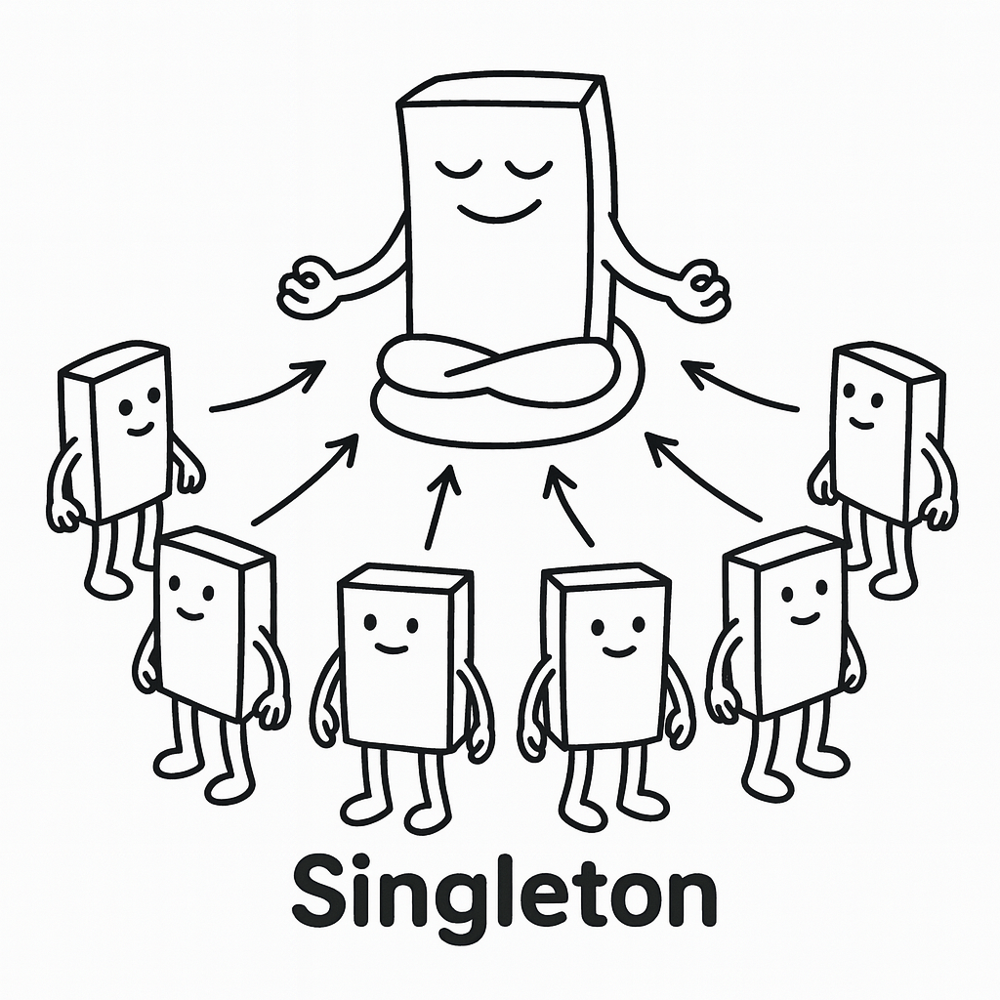
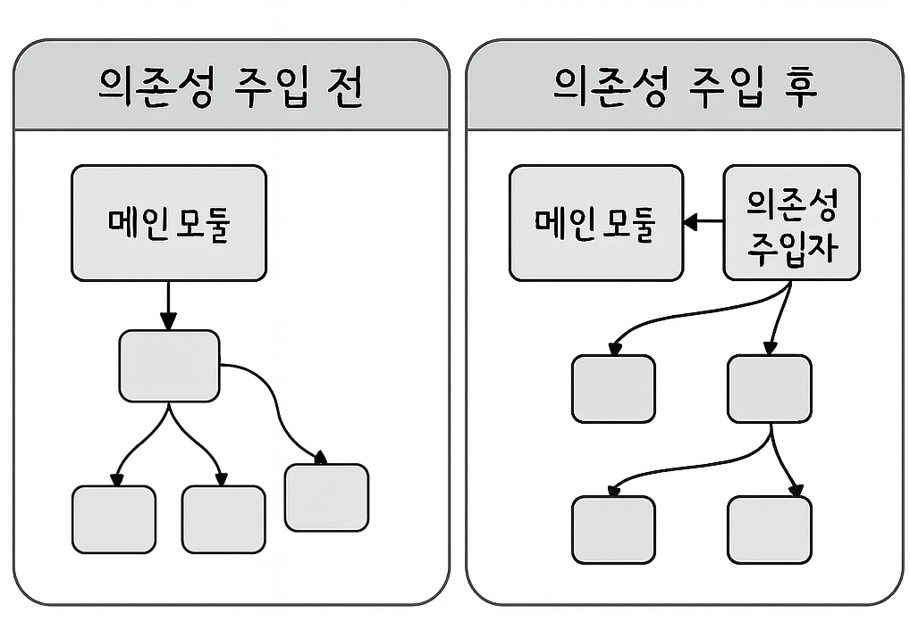
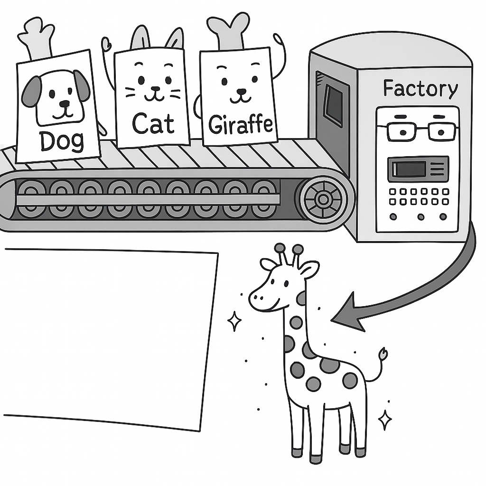
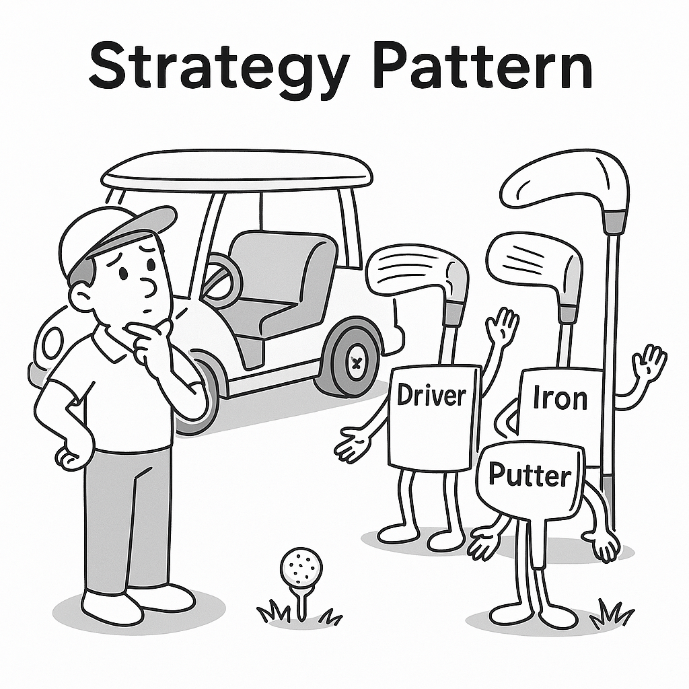

# 1장 디자인 패턴과 프로그래밍 패러다임

## 디자인패턴
프로그램을 설계할 때 발생했던 문제점들을 객체 간의 상호 관계 등을 이용하여 해결할 수 있도록 하나의 '규약'형태로 만들어 놓은 것을 의미한다.

## 싱글톤패턴
<br>
하나의 클래스에 **오직 하나의 인스턴스**만 가지는 패턴이다.<br>
보통 **데이터베이스 연결 모듈**에 많이 사용된다.<br>
**장점**: 하나의 인스턴스를 다른 모듈이 공유하여 사용하여 인스턴스 생성 비용이 줄어든다.<br>
**단점**: 의존성이 높아진다.<br>

### 싱글톤 패턴 수동 구현 방식
- 초기화 타이밍 제어나 복잡한 로직을 사용해야할 때 가능
```java
// 싱글톤 클래스 정의
class Singleton {

    // 정적 내부 클래스. Singleton 인스턴스를 보관하는 역할만 함.
    private static class SingleInstanceHolder {
        // 클래스 로딩 시 단 한 번만 초기화됨 (JVM이 보장함)
        private static final Singleton INSTANCE = new Singleton();
    }

    // 외부에서는 이 메서드로만 인스턴스를 얻을 수 있음
    public static Singleton getInstance() {
        // getInstance()가 호출될 때, 내부 클래스가 로딩되며 INSTANCE가 생성됨
        return SingleInstanceHolder.INSTANCE;
    }

    // 생성자는 외부에서 호출할 수 없도록 private 지정
    private Singleton() {
        // 생성자에 어떤 초기화 로직이 있어도 외부에서 new로 생성 못함
    }
}
```

```java
// 싱글톤 테스트용 클래스
public class HelloWorld {
    public static void main(String[] args) {
        // Singleton 인스턴스를 두 번 호출
        Singleton a = Singleton.getInstance();
        Singleton b = Singleton.getInstance();

        // 두 인스턴스의 주소를 확인 (hashCode가 같으면 같은 객체)
        System.out.println(a.hashCode());
        System.out.println(b.hashCode());

        // 같은 인스턴스인지 비교 (싱글톤이면 항상 true여야 함)
        if (a == b) {
            System.out.println(true); // true 출력됨
        }
    }
}
```

### Enum 방식
- 가장 간단하고 안전하게 구현 가능
```java
// enum을 이용한 싱글톤 정의
public enum Singleton {
    // 단 하나의 인스턴스를 정의
    INSTANCE;

    // 싱글톤 인스턴스가 호출할 수 있는 일반 메서드
    public void someMethod() {
        System.out.println("메서드 호출");
    }
}
```
```java
// 싱글톤 테스트용 클래스
public class HelloWorld {
    public static void main(String[] args) {
        // Singleton 인스턴스를 두 번 받아옴
        Singleton a = Singleton.INSTANCE;
        Singleton b = Singleton.INSTANCE;

        // 두 인스턴스의 해시코드를 출력 (같은 객체면 해시코드도 같음)
        System.out.println(a.hashCode());
        System.out.println(b.hashCode());

        // 같은 인스턴스인지 비교 (싱글톤이므로 항상 true)
        if (a == b) {
            System.out.println(true); // true 출력됨
        }

        // 싱글톤 인스턴스의 메서드 호출
        a.someMethod(); // "메서드 호출" 출력됨
    }
}
```

객체 초기화 타이밍을 제어하고 싶으면 수동방식으로 구현하고, 그게 아니면 **Enum방식이 간결하고 리플렉션/직렬화 방어가 자동**으로 되어 권장된다.

### mongoose의 싱글톤 패턴
Node.js에서 MongoDB 데이터베이스를 연결할 때 쓰는 mongoose모듈에서 볼 수 있다.
mongoose의 데이터베이스를 연결할 때 쓰는 conect()라는 함수는 싱글톤 인스턴스를 반환한다.

```javascript
import mongoose from 'mongoose';

// 환경 변수에서 MongoDB 연결 URI를 가져옵니다.
const MONGODB_URI = process.env.MONGODB_URI;

if (!MONGODB_URI) {
  throw new Error(
    'Please define the MONGODB_URI environment variable inside .env.local'
  );
}

/**
 * 전역(Global) 객체를 사용하여 데이터베이스 연결을 관리합니다.
 * 개발 환경에서는 파일이 변경될 때마다 모듈이 초기화되는데,
 * 이때 연결을 유지하기 위해 global 객체를 활용하는 것이 좋습니다.
 */
let cached = global.mongoose;

if (!cached) {
  cached = global.mongoose = { conn: null, promise: null };
}

async function dbConnect() {
  // 1. 이미 연결된 경우, 기존 연결을 즉시 반환
  if (cached.conn) {
    console.log('🚀 Using cached database connection');
    return cached.conn;
  }

  // 2. 연결 중인 프로미스가 없으면, 새로 연결 시작
  if (!cached.promise) {
    const opts = {
      bufferCommands: false, // 연결이 끊겼을 때 명령을 버퍼링하지 않음
    };

    cached.promise = mongoose.connect(MONGODB_URI, opts).then((mongooseInstance) => {
      console.log('✅ New database connection established');
      return mongooseInstance;
    });
  }

  // 3. 진행 중인 연결 프로미스를 기다려서 연결 객체를 저장하고 반환
  try {
    cached.conn = await cached.promise;
  } catch (e) {
    cached.promise = null; // 연결 실패 시 프로미스 제거
    throw e;
  }
  
  return cached.conn;
}

export default dbConnect;
```

### MySQL의 싱클톤 패턴
Node.js에서 MySQL 데이터베이스를 연결할 때도 싱글톤 패턴이 쓰인다.
```javascript
import mysql from 'mysql2/promise';

// 싱글톤으로 관리될 커넥션 풀 객체
let pool;

const getPool = () => {
  // 1. pool이 없으면 새로 생성 (최초 한 번만 실행)
  if (!pool) {
    console.log('✅ Creating new MySQL connection pool...');
    pool = mysql.createPool({
      host: process.env.DB_HOST || 'localhost',
      user: process.env.DB_USER,
      password: process.env.DB_PASSWORD,
      database: process.env.DB_NAME,
      waitForConnections: true, // 사용 가능한 커넥션이 없을 때 대기
      connectionLimit: 10,      // 최대 커넥션 수
      queueLimit: 0,            // 대기열 한도 (0은 무제한)
    });
  }

  // 2. 이미 생성된 pool이 있으면 즉시 반환
  return pool;
};

export default getPool;
```

### 싱글톤패턴 단점
TDD(Test Driven Development)를 할 때 단위 테스트를 주로 하는데, 단위 테스트는 테스트가 서로 독립적이어야 하며 어떤 순서로든 실행할 수 있어야 한다.<br>
하지만 싱글톤 패턴은 미리 생성된 하나의 인스턴스를 기반으로 구현하는 패턴이므로 각 테스트마다 **독립적인** 인스턴스를 만들기가 어렵다.

### 의존성 주입
모듈 간의 결합을 강하게 만드는 단점이 있다.<br>
이때 의존성 주입(DI, Dependency Injection)을 통해 모듈 간의 결함을 조금 더 느슨하게 만들어 해결 할 수 있다.<br>

<br>
메인 모듈이 '직접' 다른 하위 모듈에 대한 의존성을 주기보다는 중간에 의존성 주입자가 이 부분을 가로채 메인 모듈이 '간접'적으로 의존성을 주입하는 방식이다.<br>
이를 통해 메인 모듈(상위 모듈)은 하위 모듈에 대한 의존성이 떨어지게 된다. 이를 '디커플링'이라 한다.

### 의존성 주입의 장점
모듈들을 쉽게 교체할 수 있는 구조가 되어 테스트하기 쉽고 마이그레이션하기도 수월한다.<br>
또한, 구현할 때 추상화 레이어를 넣고 이를 기반으로 구현체를 넣어주기 때문에 애플리케이션 의존성 방향이 일관되고, 애플리케이션을 쉽게 추론할 수 있으며, 모듈 간의 관계들이 조금 더 명확해진다.

### 의존성 주입의 단점
모듈들이 더욱 더 분리되므로 클래스 수가 늘어나 복잡성이 증가될 수 있으며, 런타임 패널치가 생기기도 한다.

### 의존성 주입 원칙
의존성 주입은 '상위 모듈은 하위 모듈에서 어떠한 것도 가져오지 않아야 한다. 또한, 둘 다 추상화에 의존해야 하며, 이때 추상화는 세부 사항에 의존하지 말아야 한다.'라는 의존성 주입 원칙을 지켜주며 만들어야 한다.

### 싱글톤과 의존성 주입의 관계
Spring과 같은 의존성 주입 프레임워크는 기본적으로 빈을 싱글톤 스코프로 관리하여, 의존하는 클래스에 자동으로 주입해줍니다

## 팩토리패턴
<br>
객체를 사용하는 코드에서 객체 생성 부분을 떼어낸 추상화한 패턴이다.<br> 
상속 관계에서 **상위 클래스는 객체 생성의 뼈대**만 정의하고, 하위 클래스가 생성 로직을 구현한다.<br>
상위 클래스와 하위 클래스가 분리되기 때문에 **느슨한 결합**을 가진다.<br> 
객체 생성 방식이 바뀌어도 사용하는 코드는 변경할 필요가 없어 **더 많은 유연성**을 가진다.<br>
객체 생성 로직이 따로 떼어져 있기 때문에 코드를 리팩토링하더라도 한 곳만 고칠 수 있게 되니 **유지 보수성**이 증가된다.

### 자바의 팩토리 패턴
```java
// --- Product (제품) ---
// 모든 커피의 공통 인터페이스(또는 추상 클래스)
abstract class Coffee {
    public abstract int getPrice();

    @Override
    public String toString() {
        return "Hi! This " + this.getClass().getSimpleName() + " is " + this.getPrice() + " won.";
    }
}

// Latte 클래스
class Latte extends Coffee {
    private int price;

    public Latte(int price) {
        this.price = price;
    }

    @Override
    public int getPrice() {
        return this.price;
    }
}

// Americano 클래스
class Americano extends Coffee {
    private int price;

    public Americano(int price) {
        this.price = price;
    }

    @Override
    public int getPrice() {
        return this.price;
    }
}

// --- Creator (생성자) ---
// 커피를 생성하는 '팩토리'의 추상 클래스
// 어떤 커피를 만들지는 하위 클래스가 결정.
abstract class CoffeeFactory {
    
    // 이 메서드가 바로 '팩토리 메서드'
    // 하위 클래스에서 이 메서드를 구현하여 구체적인 커피 객체를 생성.
    public abstract Coffee createCoffee();

    // 팩토리의 공통 로직
    public Coffee orderCoffee() {
        // 커피 생성은 하위 클래스에 위임
        Coffee coffee = createCoffee();
        // 생성된 커피에 대한 공통적인 후처리 로직을 여기에 추가.
        System.out.println(coffee.getClass().getSimpleName() + " has been ordered.");
        return coffee;
    }
}

// Latte를 생성하는 구체적인 팩토리
class LatteFactory extends CoffeeFactory {
    private int price;

    public LatteFactory(int price) {
        this.price = price;
    }

    @Override
    public Coffee createCoffee() {
        // Latte 인스턴스를 생성하여 반환.
        return new Latte(this.price);
    }
}

// Americano를 생성하는 구체적인 팩토리
class AmericanoFactory extends CoffeeFactory {
    private int price;

    public AmericanoFactory(int price) {
        this.price = price;
    }

    @Override
    public Coffee createCoffee() {
        // Americano 인스턴스를 생성하여 반환.
        return new Americano(this.price);
    }
}


// --- Client (클라이언트) ---
// 메인 클래스에서 팩토리를 사용하여 객체를 생성.
public class Barista {
    public static void main(String[] args) {
        System.out.println("--- Welcome to the Factory Method Cafe ---");

        // 1. 라떼를 주문하기 위해 '라떼 팩토리'를 사용.
        CoffeeFactory latteFactory = new LatteFactory(4500);
        Coffee latte = latteFactory.orderCoffee();
        System.out.println("Received: " + latte);

        System.out.println("--------------------");

        // 2. 아메리카노를 주문하기 위해 '아메리카노 팩토리'를 사용.
        CoffeeFactory americanoFactory = new AmericanoFactory(3000);
        Coffee americano = americanoFactory.orderCoffee();
        System.out.println("Received: " + americano);
    }
}
```

## 전략패턴
<br>
객체가 특정 행위를 수행하는 여러 방법(전략)들을 각각의 클래스로 캡슐화하고, 이들을 동적으로 교체할 수 있도록 만드는 패턴이다. 이를 통해 **행위를 사용하는 코드(컨텍스트)**와 **실제 행위의 구현(전략)**을 분리하여, 컨텍스트 수정 없이도 새로운 전략을 자유롭게 추가하거나 변경할 수 있다.

### Java로 구현한 전략패턴 예시 (할인 정책 패턴)
```java
import java.text.NumberFormat;
import java.util.ArrayList;
import java.util.List;
import java.util.Locale;

/**
 * 전략 인터페이스 (Strategy)
 * - 모든 할인 전략은 이 인터페이스를 구현합니다.
 * - 원본 가격을 받아 할인된 가격을 반환하는 단일 메서드를 정의합니다.
 */
interface DiscountStrategy {
    long applyDiscount(long originalPrice);
}

/**
 * 구체적인 전략 1: 정액 할인 (Concrete Strategy)
 */
class FixedAmountDiscountStrategy implements DiscountStrategy {
    private final long discountAmount;

    public FixedAmountDiscountStrategy(long discountAmount) {
        this.discountAmount = discountAmount;
    }

    @Override
    public long applyDiscount(long originalPrice) {
        // 할인 금액이 원본 가격보다 클 수 없으므로, 최소 0원을 보장합니다.
        return Math.max(0, originalPrice - discountAmount);
    }
}

/**
 * 구체적인 전략 2: 정률 할인 (Concrete Strategy)
 */
class PercentageDiscountStrategy implements DiscountStrategy {
    private final double percentage; // 0.1은 10%, 0.15는 15%

    public PercentageDiscountStrategy(double percentage) {
        this.percentage = percentage;
    }

    @Override
    public long applyDiscount(long originalPrice) {
        return originalPrice - (long)(originalPrice * percentage);
    }
}

/**
 * 구체적인 전략 3: 할인이 없는 경우 (Null Object Pattern)
 * - 할인이 없는 경우를 위한 전략 객체입니다.
 * - 이렇게 하면 클라이언트 코드에서 null 체크를 할 필요가 없어집니다.
 */
class NoDiscountStrategy implements DiscountStrategy {
    @Override
    public long applyDiscount(long originalPrice) {
        // 아무 할인도 적용하지 않고 원본 가격을 그대로 반환합니다.
        return originalPrice;
    }
}

/**
 * 상품 클래스
 */
class Item {
    private final String name;
    private final long price; // int보다 큰 금액을 다루기 위해 long 사용

    public Item(String name, long price) {
        this.name = name;
        this.price = price;
    }

    public String getName() {
        return name;
    }

    public long getPrice() {
        return price;
    }
}

/**
 * 컨텍스트 클래스 (Context)
 * - 할인 전략을 사용하는 주체입니다.
 */
class Order {
    private final List<Item> items = new ArrayList<>();
    // Order는 구체적인 할인 방식을 모르고, 오직 DiscountStrategy 인터페이스에만 의존합니다.
    private DiscountStrategy discountStrategy;

    public Order() {
        // 기본적으로는 할인이 없는 전략을 가집니다.
        this.discountStrategy = new NoDiscountStrategy();
    }
    
    public void addItem(Item item) {
        this.items.add(item);
    }
    
    // 런타임에 동적으로 할인 전략을 변경할 수 있습니다.
    public void setDiscountStrategy(DiscountStrategy discountStrategy) {
        this.discountStrategy = discountStrategy;
    }

    public long getTotalPrice() {
        long originalPrice = items.stream().mapToLong(Item::getPrice).sum();
        // 실제 계산은 위임받은 전략 객체가 수행합니다.
        return discountStrategy.applyDiscount(originalPrice);
    }
}


/**
 * 메인 실행 클래스
 */
public class OnlineStore {
    public static void main(String[] args) {
        // 상품 준비
        Item laptop = new Item("LG 그램 노트북", 1_800_000L);
        Item mouse = new Item("로지텍 무선 마우스", 70_000L);

        // 주문 생성 및 상품 추가
        Order order = new Order();
        order.addItem(laptop);
        order.addItem(mouse);
        
        // 원화(KRW) 형식으로 보기 좋게 출력하기 위한 포매터
        NumberFormat krwFormat = NumberFormat.getCurrencyInstance(Locale.KOREA);

        long originalPrice = 1_870_000L;
        System.out.println("주문 원가: " + krwFormat.format(originalPrice));
        System.out.println("----------------------------------------");

        // 시나리오 1: 신규 가입자 10% 할인 이벤트 적용
        order.setDiscountStrategy(new PercentageDiscountStrategy(0.1));
        System.out.println("적용된 할인: 신규 가입자 10% 할인");
        System.out.println("최종 결제 금액: " + krwFormat.format(order.getTotalPrice()));
        System.out.println();
        
        // 시나리오 2: 여름맞이 50,000원 할인 쿠폰 적용
        order.setDiscountStrategy(new FixedAmountDiscountStrategy(50_000L));
        System.out.println("적용된 할인: 여름맞이 50,000원 할인");
        System.out.println("최종 결제 금액: " + krwFormat.format(order.getTotalPrice()));
        System.out.println();

        // 시나리오 3: 아무 할인도 적용하지 않음
        order.setDiscountStrategy(new NoDiscountStrategy());
        System.out.println("적용된 할인: 없음");
        System.out.println("최종 결제 금액: " + krwFormat.format(order.getTotalPrice()));
    }
}
```

### Passport의 전략 패턴

Passport는 Node.js용 인증 미들웨어 라이브러리로, **전략 패턴**을 활용해 다양한 인증 방식을 런타임에 교체할 수 있도록 설계되어 있다.

- **Strategy 인터페이스**: Passport가 정의한 `Strategy` 기반 클래스  
- **LocalStrategy**: 서비스 내에 가입된 아이디/비밀번호로 인증  
- **OAuthStrategy**: 페이스북, 네이버, 구글 등 외부 OAuth 제공자를 통한 인증  
- (필요시) **커스텀 Strategy**: 개발자가 직접 구현해 추가 가능

이처럼 Passport는 각 인증 알고리즘을 `Strategy` 클래스로 캡슐화하여, 컨텍스트인 Express 앱 코드(`app.use(passport.authenticate('local'))` 등)를 수정하지 않고도 새로운 인증 방식을 쉽게 추가·교체할 수 있다.

```javascript
// 1) passport 모듈 불러오기
const passport = require('passport');
// 2) local 전략 불러오기
const LocalStrategy = require('passport-local').Strategy;

// 3) LocalStrategy 등록
passport.use(new LocalStrategy(
  // (옵션) 필드명이 기본값(username, password)과 다르다면 이렇게 지정
  // { usernameField: 'email', passwordField: 'passwd' },
  function(username, password, done) {
    // 예: Mongoose 모델에서 사용자 조회
    User.findOne({ username: username }, function(err, user) {
      if (err) { 
        return done(err); 
      }
      if (!user) {
        // 사용자 미발견
        return done(null, false, { message: 'Incorrect username.' });
      }
      if (!user.validPassword(password)) {
        // 비밀번호 불일치
        return done(null, false, { message: 'Incorrect password.' });
      }
      // 인증 성공
      return done(null, user);
    });
  }
));
```